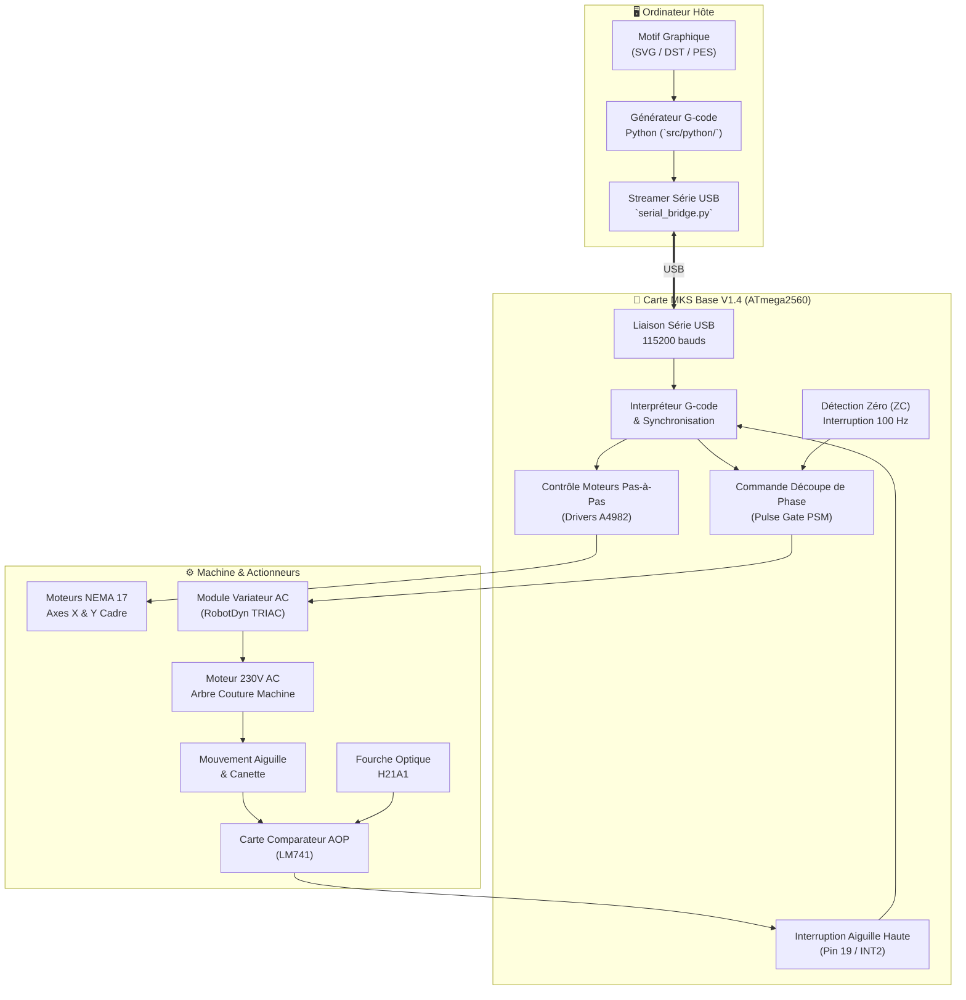

# 🧵 Tableau de Bord — Brodeuse Numérique CNC

> [!NOTE]
> **Projet de Synthèse :** Rétrofit et automatisation d'une machine à coudre conventionnelle en brodeuse numérique 2 axes ($X/Y$) pilotée par G-code, synchronisée sur la cinématique de l'aiguille.

---

## 🗺️ Navigation Rapide (Map of Content)

```
                              [ PROJET BRODERIE CNC ]
                                         |
     +---------------+---------------+---+---------------+---------------+
     |               |               |                   |               |
     v               v               v                   v               v
📋 Gestion &     ⚡ Électronique    👁️ Capteurs &       ⚙️ Mécanique &   💻 Logiciel &
   Feuille Route    & Puissance     Synchronisation      Cinématique     Firmware
```

### 📋 1. Gestion de Projet & Spécifications
* `[[Cahier_des_Charges|🎯 Cahier des Charges & Objectifs]]` — Spécifications issues du sujet initial, missions et jalons.
* `[[Suivi_des_Taches|📋 Feuille de Route & Suivi des Tâches]]` — Checklist active, priorités du moment et tâches futures.
* `[[Planning_Gantt.gan|📊 Diagramme de Gantt (GanttProject)]]` — Calendrier prévisionnel des lots de travail.

### ⚡ 2. Électronique & Puissance
* `[[Carte_MKS_Base_V1_4|🧠 Carte MKS Base V1.4]]` — Cerveau de commande (ATmega2560), drivers A4982, entrées capteurs.
* `[[Module_Variateur_AC|🔌 Module Variateur AC (RobotDyn)]]` — Découpe de phase par TRIAC pour régulation moteur 230V.
* `[[Configuration_PWM_Arduino|⏱️ Configuration Fast PWM (25 kHz)]]` — Calcul des registres Timer 1 sur microcontrôleur.

### 👁️ 3. Capteurs & Synchronisation Aiguille
* `[[Fourche_Optique_H21A1|🔍 Capteur Optique H21A1]]` — Détection de position haute aiguille & analyse des temps de réponse.
* `[[Conditionnement_AOP_H21A1|🛠️ Conditionnement AOP (Comparateur LM741)]]` — Carte d'adaptation d'impédance & PCB KiCad.

### ⚙️ 4. Mécanique & Cinématique
* `[[Plateau_XY_et_Mecanique|📐 Plateau XY & Cinématique]]` — Cadre de broderie, courroies GT2, calcul de résolution et fenêtre temporelle de déplacement hors tissu.

### 💻 5. Logiciel & Firmware
* `[[Architecture_Logicielle|💻 Architecture Logicielle & Pipeline Numérique]]` — Chaîne Python (vectorisation/G-code) + Cœur temps réel Arduino.
* **Firmware Arduino :** [[test_H21A1.ino]] (test interruption INT2).
* **Communication :** [[serial_bridge.py]].

### 📅 6. Journaux de Bord Quotidiens
* `[[2026-10-01|📅 Journal du 01 Octobre 2026]]` — Restructuration complète de l'architecture projet & déploiement Obsidian.
* `[[2026-09-30|📅 Journal du 30 Septembre 2026]]` — Conception PCB comparateur AOP & étude du variateur AC RobotDyn.
* `[[2026-09-29|📅 Journal du 29 Septembre 2026]]` — Étude capteur H21A1, carte MKS Base et initialisation Gantt.

---

## 🧩 Architecture Système Visuelle



---

## 🚀 Vue Interactive Canvas
> [!TIP]
> Ouvrez la vue visuelle interactive complète : **[[Projet_Broderie.canvas]]** pour explorer les blocs d'interconnexion matérielle et logicielle sous forme de schéma dynamique.

---

## 📚 Bibliothèque de Datasheets & Schémas PDF
* 📄 [[capteur_position_H21A1.pdf|Datasheet Fourche Optique H21A1]]
* 📄 [[Module_Variateur_AC_RobotDyn.pdf|Documentation Variateur AC RobotDyn]]
* 📄 [[MKS_BASE_PINS.pdf|Brochage Connecteurs MKS Base V1.4]]
* 📄 [[MKS_BASE_V1_4_Schematic_Alimentation_P1.pdf|Schéma MKS Base - Alimentation]]
* 📄 [[MKS_BASE_V1_4_Schematic_MOSFETs_P2.pdf|Schéma MKS Base - MOSFETs]]
* 📄 [[MKS_BASE_V1_4_Schematic_Drivers_P3.pdf|Schéma MKS Base - Drivers Pas-à-Pas]]
* 📄 [[ATMEGA640.PDF|Datasheet Microcontrôleur ATmega2560 / 640]]

---

## ⚙️ Outils & Modèles Obsidian
Pour créer une nouvelle note propre et standardisée, utilisez les modèles dans `docs/templates/` :
* [[Template_Fiche_Technique.md]] (pour un composant électronique ou mécanique)
* [[Template_Journal.md]] (pour le rapport quotidien de séance)
* [[Template_Tache.md]] (pour une nouvelle tâche ou réunion)
